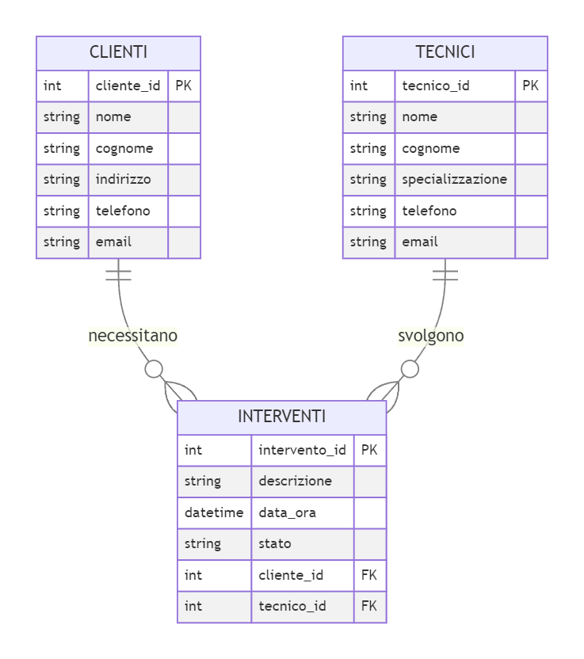

### Tema d'esame di maturità ITIA

#### Traccia

Un'azienda informatica si occupa di gestire gli interventi di manutenzione e assistenza presso i propri clienti. Gli interventi possono riguardare problemi hardware, software, di rete, ecc. La gestione di questi interventi necessita di una base dati strutturata che permetta di monitorare le attività svolte dai tecnici, le richieste dei clienti e lo stato degli interventi.

### Parte 1: Modello concettuale



### Parte 2: Modello logico

- Clienti (PK:cliente_id, nome, cognome, indirizzo, telefono, email)
- Tecnici (PK:tecnico_id, nome, cognome, specializzazione, telefono, email)
- Interventi (PK:intervento_id, descrizione, data_ora, stato, FK:cliente_id, FK:tecnico_id)

### Parte 3: Modello fisico

```sql
CREATE TABLE Clienti (
    cliente_id INT PRIMARY KEY,
    nome VARCHAR(100),
    cognome VARCHAR(100),
    indirizzo VARCHAR(255),
    telefono VARCHAR(20),
    email VARCHAR(100)
);

CREATE TABLE Tecnici (
    tecnico_id INT PRIMARY KEY,
    nome VARCHAR(100),
    cognome VARCHAR(100),
    specializzazioni VARCHAR(100),
    telefono VARCHAR(20),
    email VARCHAR(100)
);

CREATE TABLE Interventi (
    intervento_id INT PRIMARY KEY,
    descrizione TEXT,
    data_ora DATETIME,
    stato VARCHAR(20),
    cliente_id INT,
    tecnico_id INT,
    FOREIGN KEY (cliente_id) REFERENCES Clienti(cliente_id),
    FOREIGN KEY (tecnico_id) REFERENCES Tecnici(tecnico_id)
);
```

### Parte 4: Query sql

Trova tutti gli interventi assegnati a un determinato tecnico in un dato periodo

```sql
SELECT *
FROM Interventi
WHERE tecnico_id = [IDTecnico]
AND data_ora BETWEEN '[DataInizio]' AND '[DataFine]';
```

Elenca tutti i clienti che hanno richiesto interventi negli ultimi sei mesi

```sql
SELECT DISTINCT C.*
FROM Clienti
JOIN Interventi ON Clienti.cliente_id = Interventi.cliente_id
WHERE Interventi.data_ora >= DATEADD(MONTH, -6, CURRENT_TIMESTAMP);
```

Conta il numero di interventi completati con successo in un determinato periodo

```sql
SELECT COUNT(*)
FROM Interventi
WHERE stato = 'completato'
AND data_ora BETWEEN '[DataInizio]' AND '[DataFine]';
```

Trova i tecnici che hanno specializzazioni in entrambi i campi hardware e software

```sql
SELECT *
FROM Tecnici
WHERE specializzazioni LIKE '%hardware%'
AND specializzazioni LIKE '%software%';
```

### Parte 5: Framework web

Modulo per l'inserimento e la modifica dei dati dei clienti

```python
@app.route('/clienti/nuovo', methods=['GET', 'POST'])
def nuovo_cliente():
    if request.method == 'POST':
        nome = request.form['nome']
        cognome = request.form['cognome']
        indirizzo = request.form['indirizzo']
        telefono = request.form['telefono']
        email = request.form['email']

        conn = get_db_connection()
        cur = conn.cursor()
        cur.execute('INSERT INTO Clienti (nome, cognome, indirizzo, telefono, email) VALUES (%s, %s, %s, %s, %s)',
                    (nome, cognome, indirizzo, telefono, email))
        conn.commit()
        cur.close()
        conn.close()
        return redirect(url_for('lista_clienti'))
    return render_template('modifica_cliente.html')

```

Modulo per la gestione degli interventi (creazione, aggiornamento, chiusura)

```python
@app.route('/interventi/nuovo', methods=['GET', 'POST'])
def nuovo_intervento():
    if request.method == 'POST':
        descrizione = request.form['descrizione']
        data_ora = request.form['data_ora']
        stato = request.form['stato']
        cliente_id = request.form['cliente_id']
        tecnico_id = request.form['tecnico_id']

        conn = get_db_connection()
        cur = conn.cursor()
        cur.execute('INSERT INTO Interventi (descrizione, data_ora, stato, cliente_id, tecnico_id) VALUES (%s, %s, %s, %s, %s)',
                    (descrizione, data_ora, stato, cliente_id, tecnico_id))
        conn.commit()
        cur.close()
        conn.close()
        return redirect(url_for('lista_interventi'))

    conn = get_db_connection()
    cur = conn.cursor()
    cur.execute('SELECT cliente_id, nome, cognome FROM Clienti;')
    clienti = cur.fetchall()
    cur.execute('SELECT tecnico_id, nome, cognome FROM Tecnici;')
    tecnici = cur.fetchall()
    cur.close()
    conn.close()
    return render_template('modifica_intervento.html', clienti=clienti, tecnici=tecnici)

```

Interfaccia per visualizzare lo stato degli interventi e i dettagli associati

```python
@app.route('/interventi')
def lista_interventi():
    conn = get_db_connection()
    cur = conn.cursor()
    cur.execute('SELECT intervento_id, descrizione, data_ora, stato FROM Interventi;')
    interventi = cur.fetchall()
    cur.close()
    conn.close()
    return render_template('lista_interventi.html', interventi=interventi)

@app.route('/interventi/<int:id>')
def dettaglio_intervento(id):
    conn = get_db_connection()
    cur = conn.cursor()
    cur.execute('SELECT * FROM Interventi WHERE intervento_id = %s;', (id,))
    intervento = cur.fetchone()
    cur.close()
    conn.close()
    return render_template('dettaglio_intervento.html', intervento=intervento)

```
